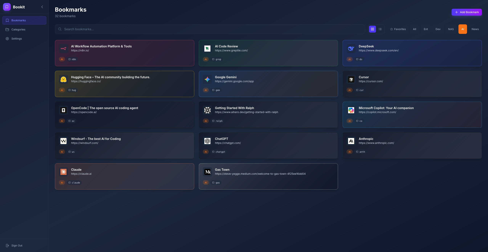

# Bookit

A modern, self-hosted bookmarks manager built with Next.js 15. Designed for personal use with a focus on speed, keyboard navigation, and visual appeal.



## Features

### Bookmark Management
- **Add bookmarks** with name, URL, description, and category
- **Auto-fetch metadata** - URL titles and favicons are automatically retrieved
- **Custom images** - Upload your own icons or let Bookit fetch favicons automatically
- **Categories** - Organize bookmarks with color-coded categories
- **Search** - Quickly filter bookmarks by name, URL, or description

### Keyboard Shortcuts
- **Custom key sequences** - Assign shortcuts like `goo` for Google, `gh` for GitHub
- **Quick access** - Type your shortcut anywhere on the dashboard to instantly open the bookmark
- **Visual indicators** - Shortcuts are displayed on each bookmark card

### Visual Design
- **Dynamic theming** - Bookmark cards extract colors from favicons for unique gradient backgrounds and borders
- **Smooth animations** - Framer Motion powers fluid transitions throughout the app
- **Responsive layout** - Works on desktop and mobile devices
- **Collapsible sidebar** - Maximize your viewing area when needed

### Security
- **Single-user authentication** - Credentials-based login with NextAuth.js v5
- **Protected routes** - All data is private and requires authentication
- **Secure password storage** - Passwords are hashed with bcrypt

### Self-Hosted
- **Docker ready** - Includes Dockerfile and docker-compose for easy deployment
- **SQLite database** - Simple, file-based storage with no external dependencies
- **Unraid compatible** - Designed for home server deployment

## Tech Stack

- **Framework**: Next.js 15 (App Router)
- **Database**: SQLite with Drizzle ORM
- **Authentication**: NextAuth.js v5
- **Styling**: TailwindCSS 4
- **Animations**: Framer Motion
- **Icons**: Heroicons

## Getting Started

### Prerequisites
- Node.js 20+
- npm or yarn

### Installation

1. Clone the repository:
   ```bash
   git clone https://github.com/yourusername/bookit.git
   cd bookit
   ```

2. Install dependencies:
   ```bash
   npm install
   ```

3. Create environment file:
   ```bash
   cp .env.example .env
   ```

4. Configure your `.env` file:
   ```env
   AUTH_SECRET=your-secret-key-here
   INITIAL_USERNAME=admin
   INITIAL_PASSWORD=your-secure-password
   ```

5. Initialize the database:
   ```bash
   npm run db:generate
   npm run db:migrate
   npm run db:seed
   ```

6. Start the development server:
   ```bash
   npm run dev
   ```

7. Open [http://localhost:3000](http://localhost:3000) and log in with your credentials.

## Docker Deployment

### Using Docker Compose

```bash
docker-compose up -d
```

### Environment Variables

| Variable | Description | Required |
|----------|-------------|----------|
| `AUTH_SECRET` | Secret key for session encryption | Yes |
| `INITIAL_USERNAME` | Username for the initial user | Yes |
| `INITIAL_PASSWORD` | Password for the initial user | Yes |
| `AUTH_TRUST_HOST` | Set to `true` for reverse proxy setups | No |

### Volumes

- `/app/data` - SQLite database
- `/app/public/uploads` - Uploaded images and cached favicons

## License

MIT
